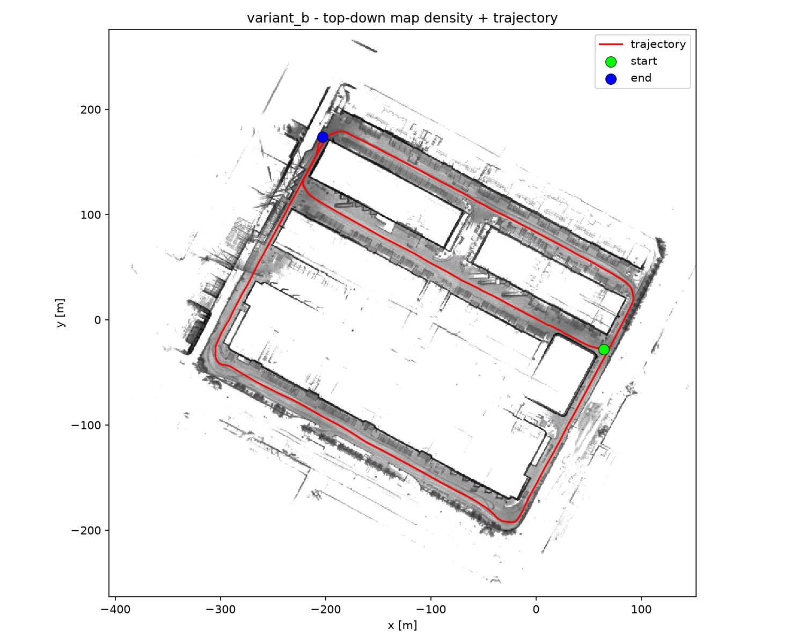

# micropolis_lidar_mapping .. from-scratch LiDAR mapping & localization

A from-scratch ROS 2 pipeline that turns MCAP bags from a mobile robot into a 3D point-cloud map and a trajectory, evaluated against RTK GNSS ground truth.



*Top-down density of the Variant B fused map with the estimated trajectory overlaid (one ~1.5 km session).*

## Overview

This repository implements LiDAR odometry and mapping from scratch the scan deskew, voxel-hash local map, and point-to-plane scan-to-map ICP are our own code, not a wrapper around an existing SLAM framework. It consumes ROS 2 MCAP bags from a single mobile robot and produces a 3D point-cloud map (`.pcd`) plus a trajectory in TUM format, which are then scored against an RTK GNSS reference.

All inputs are in the `base_link` frame; there is no `/tf`, IMU, or wheel odometry. Two topics drive everything:

- `/iv_points_fusion` -- Seyond Falcon LiDAR, ~10 Hz, with per-point absolute timestamps (used for deskew).
- `/fixposition/odometry_enu` -- Fixposition RTK GNSS/INS, ~5 cm sigma. This is the ground-truth reference for evaluation, and also the absolute prior used by Variant B.

The site is essentially flat and every bag shares one ENU datum, so all recordings and both variants live in a single global frame. GNSS is treated as the reference: the LiDAR-only result is the honest, independent measurement, and GNSS only enters the map-building path in Variant B.

**Why two sessions.** The data was recorded in two continuous stretches rather than one. Between them the robot was repositioned, leaving a gap of several metres and roughly an hour with no overlapping observations. That gap is far larger than the range over which scan matching can still find correspondences between consecutive clouds, so LiDAR odometry has no way to carry a single consistent track across it. The recording therefore splits into two independent mapping sessions, the first covers bags 01–08, the second bags 09–14 — each processed on its own and never stitched across the gap. Everything below runs once per session.

## Approach — two variants

**Variant A — pure LiDAR odometry.** Constant-velocity deskew of each scan, a voxel-hash local map, and point-to-plane scan-to-map ICP. It uses no GNSS at all, so it is the independent baseline: whatever accuracy it reaches comes entirely from the LiDAR.

**Variant B — GNSS pose-graph fusion.** Position-only GNSS priors are fused with Variant A's relative motion in a sparse SE(3) pose graph. This pins the otherwise-unobservable global Z and pitch and georeferences the map; the map is then rebuilt at the optimized poses through the exact same cloud pipeline Variant A uses.

Headline results (ATE RMSE, per session; full table in [docs/evaluation.md](docs/evaluation.md)):

| ATE RMSE [m] | Session 1 (bags 01–08) | Session 2 (bags 09–14) |
|---|--:|--:|
| Variant A (LiDAR-only) | 17.74 | 6.56 |
| Variant B (GNSS-fused) | 0.017 | 0.024 |

Variant B's centimetre ATE is a georeferencing fit, not independent LiDAR accuracy: the same GNSS positions are used as both the prior and the reference, so the number sits below the ~5 cm GNSS noise floor by construction. Variant A is therefore the honest independent measurement; Variant B shows what a cheap absolute prior buys you (the Z/pitch that LiDAR cannot observe here). See [docs/evaluation.md](docs/evaluation.md) for the complete metrics and plots.

## Repository layout

```
micropolis_lidar_mapping/
├── lidar_mapper/            # Variant A: LiDAR odometry + mapping (ROS 2 ament_cmake package)
│   ├── src/  include/       #   core library + tools (run_odometry, export_gt, inspect_bags)
│   ├── eval/                #   evaluate.py, plot_map_trajectory.py, requirements.txt
│   ├── params.yaml          #   odometry / mapping parameters
│   ├── CMakeLists.txt  package.xml
├── gnss_fusion/             # Variant B: GNSS pose-graph fusion (depends on lidar_mapper)
│   ├── src/  include/       #   pose graph + tools (run_fusion, regen_map)
│   ├── params_fusion.yaml   #   fusion weights / GNSS settings
│   ├── CMakeLists.txt  package.xml
├── docs/                    # architecture, method, challenges, evaluation (+ img/)
├── docker/run_pipeline.sh   # full-pipeline entrypoint for the container
└── Dockerfile  docker-compose.yml
```

## Run with Docker (recommended)

The quickest way to reproduce a full run. The container builds both packages in Release and runs the entire pipeline: ground truth → Variant A → Variant B → evaluation → overview plots — over one folder of `.mcap` bags. Host bags are mounted read-only at `/bags`; results are written to the host directory you mount at `/out`. Inside the container these default to the `BAGS_DIR` and `OUT_DIR` environment variables (`/bags` and `/out`). `docker-compose.yml` takes the two host paths via the `BAGS_HOST` and `OUT_HOST` environment variables, and exposes an optional `OMP_NUM_THREADS` to cap threads.

```bash
# build
docker build -t micropolis-mapper .     # or: docker compose build

# run one session folder (bags mounted read-only, results to the host)
docker run --rm \
  -v /abs/path/to/session_bags:/bags:ro \
  -v /abs/path/to/output:/out \
  micropolis-mapper

# or with compose (one session per invocation)
BAGS_HOST=/abs/path/to/session_bags OUT_HOST=/abs/path/to/output docker compose run --rm mapper
```

**Single-session contract:** one mounted bag folder is treated as one continuous session, there is no session-split logic in the image. As explained above, the dataset is two sessions (bags 01–08, then bags 09–14); run the container once per session, one folder per session, and don't mix the two in one folder. Docker usage is documented as provided in the repo; the image has not been built or tested here.

## Build & run from source (native)

For development, or to run the stages individually.

**Dependencies.** System:

- ROS 2 Jazzy on Ubuntu 24.04, built with `ament_cmake` + `colcon`.
- rosdep-managed ROS deps from the two `package.xml` files: `rclcpp`, `rosbag2_cpp` and `rosbag2_storage` plus the `rosbag2_storage_mcap` MCAP storage plugin (to read the `.mcap` bags), `sensor_msgs`, `nav_msgs`, Eigen3 (`eigen`), and `yaml-cpp`. `gnss_fusion` additionally depends on `lidar_mapper`.
- OpenMP (discovered by CMake, e.g. gcc/libgomp)  used to parallelize the per-point registration loop.

Python (evaluation only) — from `lidar_mapper/eval/requirements.txt`: `evo>=1.20.0`, `numpy`, `matplotlib`.

**Build:**

```bash
# 1. get the sources
git clone <this-repo-url> micropolis_lidar_mapping
cd micropolis_lidar_mapping

# 2. install ROS dependencies declared in the package.xml manifests
source /opt/ros/jazzy/setup.bash
rosdep install --from-paths . --ignore-src -r -y

# 3. build Release (both packages)
colcon build --packages-select lidar_mapper gnss_fusion \
  --cmake-args -DCMAKE_BUILD_TYPE=Release

# 4. source the overlay
source install/setup.bash
```

For evaluation, install the Python deps into a virtualenv:

```bash
python3 -m venv .venv && source .venv/bin/activate
pip install -r lidar_mapper/eval/requirements.txt
```

**Run the stages.** Each tool takes a directory of `.mcap` bags and globs + sorts it, so one folder is one session. The examples assume `$BAGS` points at one session's bag folder and `out/` is the output directory you want results written to.

First, export the GNSS-ENU ground truth used by evaluation:

```bash
ros2 run lidar_mapper export_gt out/gt.tum "$BAGS"
```

### (a) Variant A: LiDAR-only odometry + map

```
run_odometry <params.yaml> <out_dir> [--no-map] <bag1.mcap> [bag2.mcap ...]
```

A single directory may be given in place of the explicit bag list (it is globbed + sorted):

```bash
ros2 run lidar_mapper run_odometry lidar_mapper/params.yaml out/variant_a "$BAGS"
```

Writes `out/variant_a/trajectory.tum` and `out/variant_a/map.pcd` (pass `--no-map` to skip the map).

### (b) Variant B: GNSS pose-graph fusion + regenerated map

```
run_fusion <bag_dir> <variantA_trajectory.tum> <params_fusion.yaml> <out_dir>
regen_map  <bag_dir> <fused.tum> <variantA_params.yaml> <out_dir>
```

```bash
# fuse Variant A's trajectory with GNSS priors -> out/variant_b/fused.tum
ros2 run gnss_fusion run_fusion "$BAGS" out/variant_a/trajectory.tum \
  gnss_fusion/params_fusion.yaml out/variant_b

# rebuild the map at the fused poses -> out/variant_b/fused_map.pcd
ros2 run gnss_fusion regen_map "$BAGS" out/variant_b/fused.tum \
  lidar_mapper/params.yaml out/variant_b
```

### (c) Evaluate

```
evaluate.py <gt.tum> <est.tum> <out_dir>
```

```bash
python lidar_mapper/eval/evaluate.py out/gt.tum out/variant_a/trajectory.tum out/eval/variant_a
python lidar_mapper/eval/evaluate.py out/gt.tum out/variant_b/fused.tum       out/eval/variant_b
```

Each run writes `metrics.json` and plots into the given output directory.

## Outputs & notes

The map (`.pcd`) and trajectory (`.tum`) are written to the output directory you pass to the tools (or the host directory mounted at `/out` under Docker) — nothing is written back into the repository. Because the `.pcd` maps exceed GitHub's 100 MB per-file limit, the generated maps and trajectories are delivered out-of-band (via Google Drive) rather than committed here. One output folder corresponds to one session.

[Link to Google Drive data](https://drive.google.com/drive/folders/1Z-pRdAbrVFFJWEKkTMucjJfvgMucTRIo) 

## Documentation

- [Architecture & diagrams](docs/architecture.md)
- [Method & rationale](docs/method.md)
- [Challenges](docs/challenges.md)
- [Evaluation](docs/evaluation.md)
