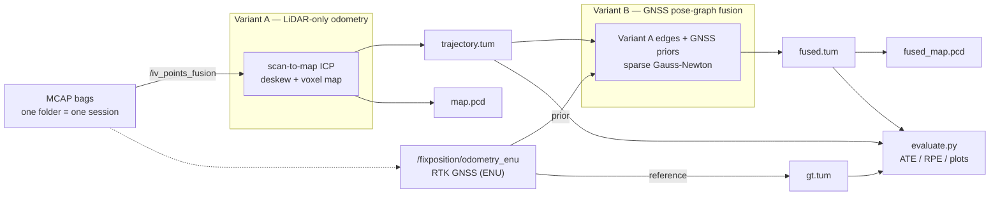
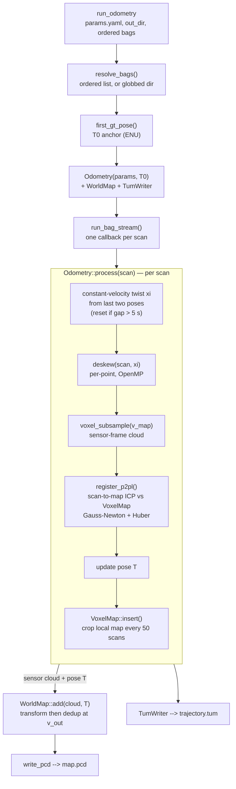
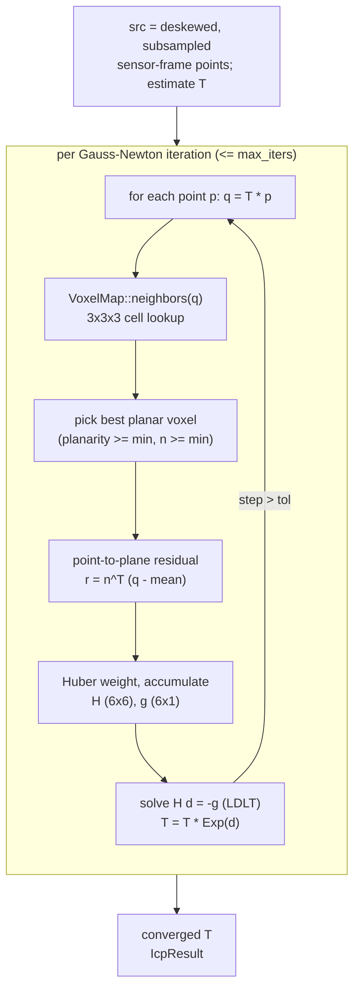
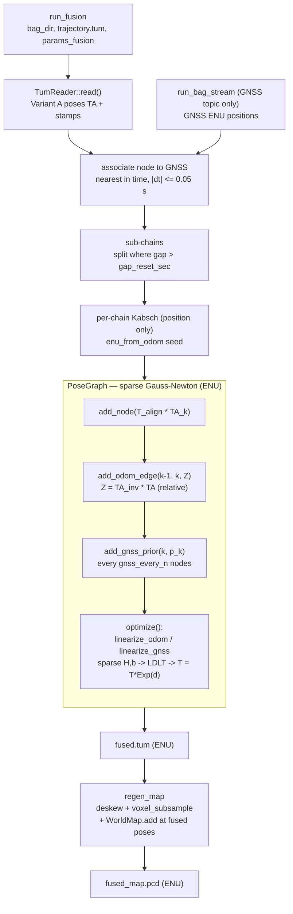
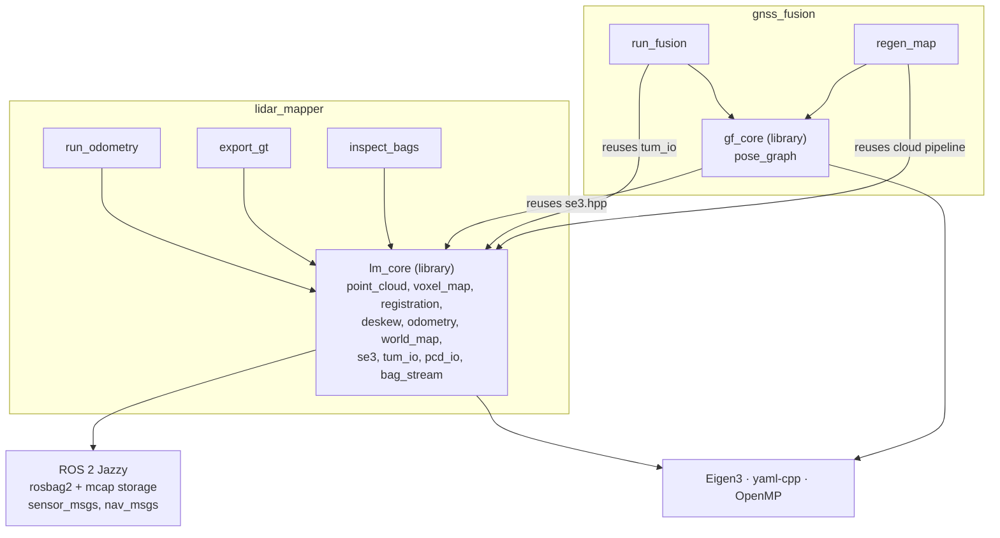
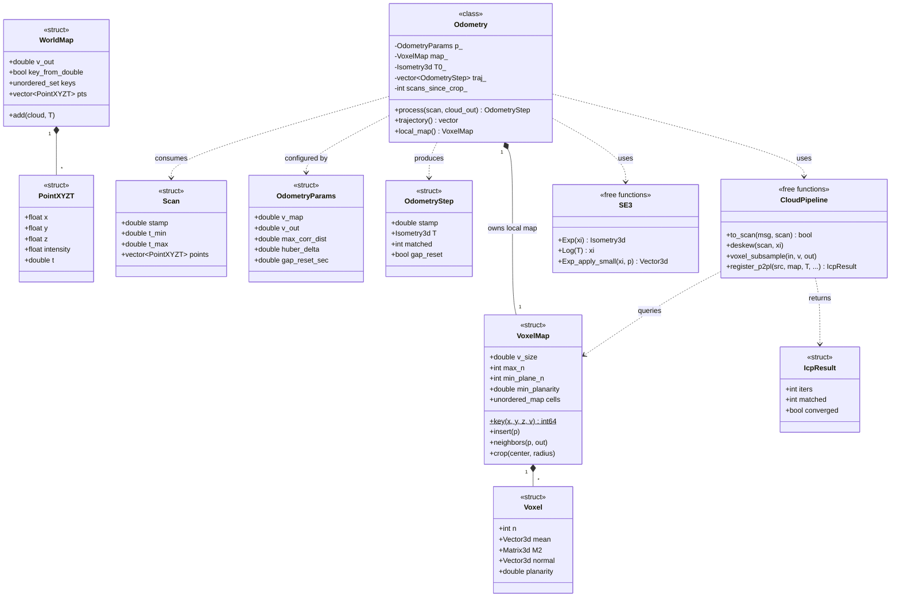
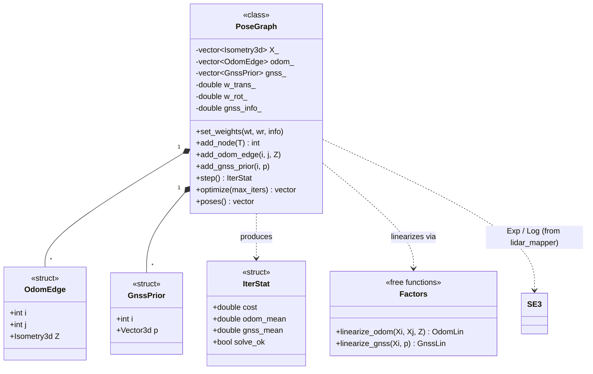

# Architecture & Visual Documentation

Visual reference for the LiDAR mapping pipeline: data flow, module structure, and the
class model for both variants. Diagrams are [Mermaid](https://mermaid.js.org/) and render
directly on GitHub.

- **Variant A** — pure LiDAR odometry (constant-velocity deskew, voxel-hash local map,
  point-to-plane scan-to-map ICP). Produces `trajectory.tum` + `map.pcd`.
- **Variant B** — GNSS pose-graph fusion layer over Variant A's relative motion. Produces
  `fused.tum` + `fused_map.pcd`.

Two ROS 2 packages: `lidar_mapper` (library `lm_core` + tools) and `gnss_fusion`
(library `gf_core` + tools). `gnss_fusion` reuses `lidar_mapper`'s SE(3) math and cloud
pipeline.

---

## 1. Pipeline overview

GNSS is used in two distinct roles: as the **ground-truth reference** for evaluation
(`export_gt` → `gt.tum`), and as an **input prior** to Variant B's fusion. Because Variant B
consumes GNSS, its agreement with GNSS is a georeferencing-fit metric, not independent LiDAR
accuracy. Variant A is the independent measurement.

---

## 2. Variant A — LiDAR-only odometry

`run_odometry` resolves the (ordered) bags, anchors the first pose to the matching GNSS pose
`T0` (georeferencing only, the metric uses SE(3) Umeyama, not this anchor), then streams every
`/iv_points_fusion` scan through `Odometry::process`. The local map is a voxel hash; the global
output map is accumulated separately by `WorldMap` (dedup at `v_out`).

### 2.1 Scan-to-map ICP inner loop (`register_p2pl`)

Point-to-plane Gauss-Newton against the accumulated voxel map. The per-point work (neighbor
lookup + Jacobian) is parallelized with OpenMP; contributions are reduced **serially in index
order** so the normal equations stay bit-identical regardless of thread count.

---

## 3. Variant B — GNSS pose-graph fusion

`run_fusion` reads Variant A's trajectory, streams **only** the GNSS topic from the bags
(skipping cloud bytes), associates each node to the nearest GNSS pose in time, splits the run
into sub-chains at large time gaps, and seeds each chain into ENU with a position-only Kabsch
fit. It then builds a sparse pose graph sequential odometry between-edges plus subsampled
GNSS unary priors — and optimizes. `regen_map` rebuilds the map at the optimized poses using
the *same* cloud pipeline as Variant A.

GNSS priors are **position-only** (no orientation). They pin absolute position (and therefore
the otherwise-unobservable Z/pitch); per-node orientation still comes from the LiDAR odometry
edges. This is why Variant B's ATE collapses to centimetres while its RPE (a relative,
orientation-coupled metric) stays comparable to Variant A.

---

## 4. Module & dependency structure

`gnss_fusion` depends on `lidar_mapper` (`find_package(lidar_mapper)` + link `lm_core`), so
both build in one colcon workspace with `lidar_mapper` first.

---

## 5. Class model — `lidar_mapper`

`Odometry` is the only stateful class (owns the local map, trajectory, and crop counter behind a
small interface). Everything else is plain data (`struct`) or a stateless free function — the
distinction is deliberate: a class where there is an invariant to protect, a struct for data,
free functions for stateless transforms.

---

## 6. Class model — `gnss_fusion`

`PoseGraph` is a class because it has a real invariant — every edge/prior must reference a valid
node index — enforced at insertion. The per-factor linearization is split into free functions
(`linearize_odom`, `linearize_gnss`) so each analytic Jacobian is unit-testable against finite
differences without any virtual dispatch.

---

### Legend

- `<<class>>` — encapsulated state + an invariant (`Odometry`, `PoseGraph`).
- `<<struct>>` — plain data carrier, public fields.
- `<<free functions>>` — stateless transforms grouped by module (not real classes).
- `*--` composition (owns) · `..>` dependency (uses / produces).
