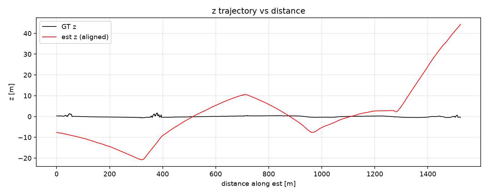

# Challenges

## Z / pitch drift is structural, not a bug

With no IMU there is no gravity reference, so pitch is only weakly observable on a flat,
straight road: a fraction of a degree of pitch bias looks almost identical against the ground
but integrates into large Z error over distance. On S01 this reaches an ATE-Z of ~13 m by the
end of a 1.5 km traverse.

This is an observability limit, not a tuning problem, and three checks confirm it:

- **KISS-ICP shows the same Z-drift shape** on the same data — so the warp is dataset-structural,
  not a flaw in this code.
- Tightening the ICP correspondence distance (2.0 → 1.0 m) left the attitude error unchanged,
  ruling out correspondence quality as the cause.
- Hardening the plane gate had a similarly negligible effect.

The principled fix is **Variant B**: GNSS priors pin Z flat (ATE-Z drops to ~5 mm), and
regenerating the map at the optimized poses removes the warp.

## The ground truth is not perfect

The RTK reference has its own artifacts, which matter when it is the yardstick:

- a **1.0 m jump within 10 ms** at t₀+26 s — an RTK/INS correction snap, not real motion; it
  shows up as a step in the error curve and must not be read as a pipeline failure.
- **109 gaps > 50 ms** in the GT stream, so GT is resampled onto the LiDAR stamps before
  comparison.

## Scan rate degrades mid-session

Over part of the run the cloud rate drops from ~10 Hz to ~5 Hz, which lengthens the deskew
interval and shows up as oscillation in the XY error. The constant-velocity model degrades
gracefully and recovers — no tracking loss.

## Two sessions, one gap

The 14 bags form two continuous sessions (bags 01–08 and 09–14). The only break is bag 08 → 09:
a 4.9 m / ~55 min gap, far beyond the 2 m correspondence radius, so no LiDAR edge can cross it.
The sessions are therefore evaluated as two independent odometry runs and never chained; the
unified map places each session at its first GNSS-matched pose.

## OpenMP determinism

Parallelizing the ICP correspondence loop initially changed results by ~19 mm, because summing
per-thread partial sums in nondeterministic order amplified floating-point non-associativity.
The fix keeps only the per-point work parallel and reduces the contributions **serially in index
order**, so the output is bit-identical to the single-threaded build at any thread count.
