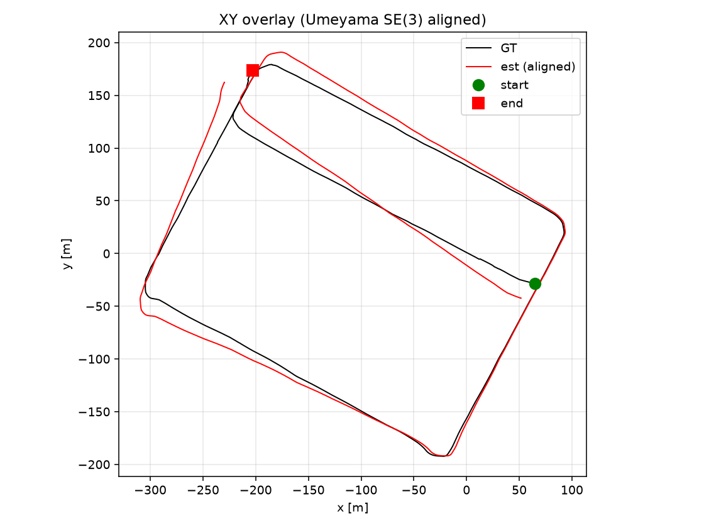
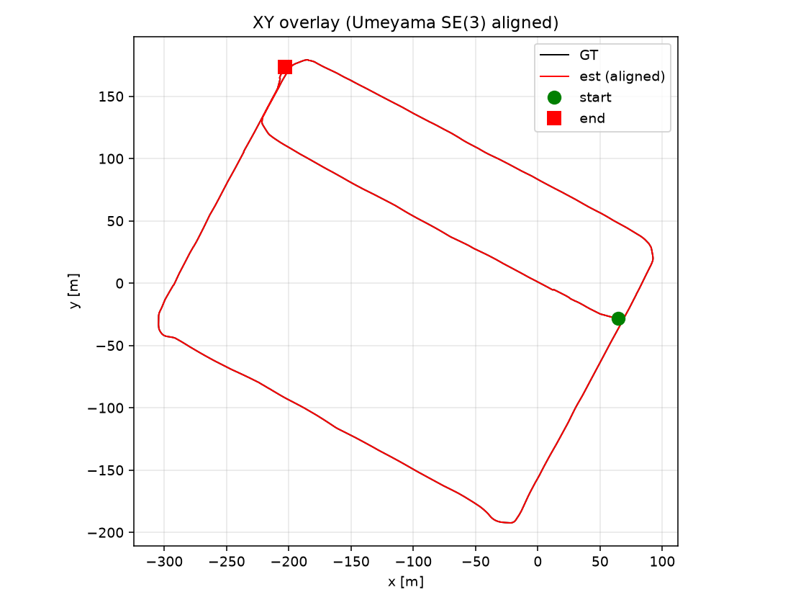
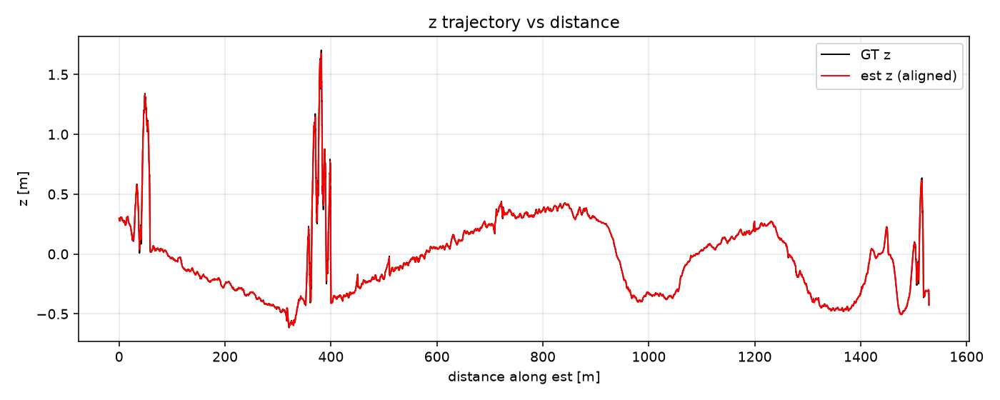
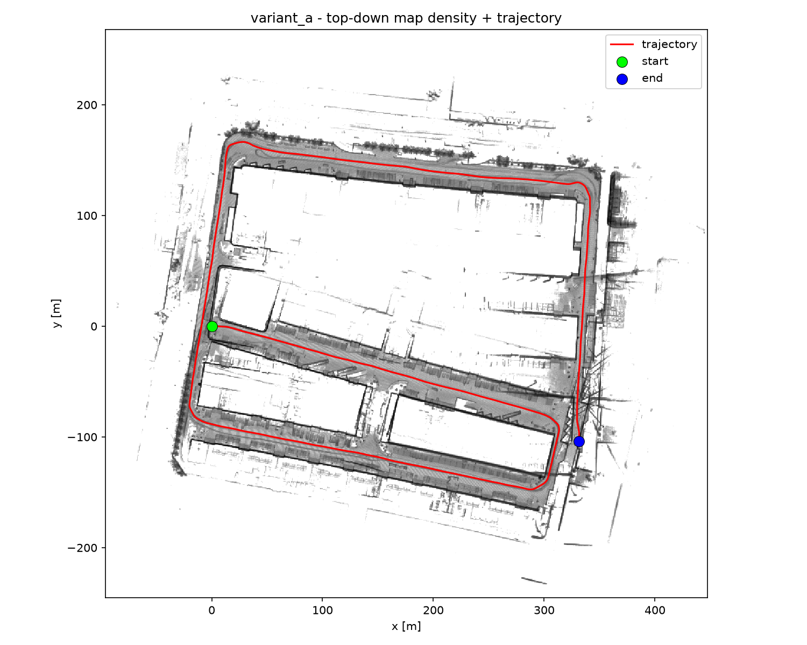

# Evaluation

## Method

The estimated trajectory is compared against the RTK GNSS reference (`gt.tum`, ~5 cm sigma
the accuracy floor). GT is resampled onto the LiDAR stamps by nearest time (|Δt| ≤ 0.05 s), and
each session is evaluated independently. Metrics are produced by `evaluate.py` and written to
`eval/<variant>/metrics.json`:

- **ATE** — SE(3) Umeyama alignment (rotation + translation, no scale), reported as RMSE and
  per-axis x/y/z. Aligning the full rigid transform, rather than anchoring the first pose,
  avoids a lever-arm error that would otherwise inflate the result.
- **RPE** — relative pose error over 10 m and 100 m sub-paths, as % drift, plus a rotation-free
  variant that isolates translation drift from attitude coupling.

## Results

Two sessions: **S01** = bags 01–08 (~1548 m GT), **S02** = bags 09–14 (~1133 m GT).

| Metric | A · S01 | A · S02 | B · S01 | B · S02 |
|---|--:|--:|--:|--:|
| ATE RMSE [m] | 17.74 | 6.56 | 0.017 | 0.024 |
| ATE Z [m] | 12.99 | 4.50 | 0.005 | 0.015 |
| RPE @10 m | 6.94 % | 9.71 % | 6.31 % | 7.50 % |
| RPE @100 m | 6.07 % | 6.56 % | 5.77 % | 6.24 % |

On S01 the large ATE comes from accumulated attitude drift (mean **9.05°**), which both bows the
SE(3)-aligned path off GT in XY and, through pitch, drives the Z error, so A's ATE is large in
every axis (x 7.7, y 9.4, z 13.0 m), not just Z. The underlying translation is nonetheless
accurate: rotation-free drift is only **0.28 % at 100 m**. This attitude coupling is described in
[challenges](challenges.md).

**Reading Variant B correctly.** Its centimetre ATE sits *below* the ~5 cm GT noise floor,
because the same GNSS positions are both the prior and the reference, so this is a
**georeferencing-fit** number, not independent LiDAR accuracy. Variant A is the honest
independent measurement; Variant B shows that adding a cheap absolute prior fixes the one thing
LiDAR cannot observe here. Note that B's RPE stays close to A's: the priors are position-only,
so relative orientation still comes entirely from the LiDAR edges.

## Plots (S01)

Estimated trajectory vs ground truth, plan view (SE(3)-aligned). Under LiDAR alone, accumulated
attitude drift bows the path off GT; with GNSS priors the trajectory sits essentially on GT:

Variant B's near-perfect fit is georeferencing, not independent accuracy - it is optimized against
the same GNSS positions it is plotted against (see "Reading Variant B correctly" above).

Z error grows with distance under LiDAR alone, then is pinned flat once GNSS is fused:

Resulting maps:

